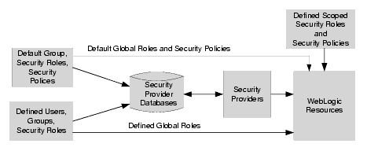

# What is _Realms?_

[___from Oracle Reference___](https://docs.oracle.com/cd/E19798-01/821-1841/6nmq2cpjd/index.html)

- Basic Concept
  - https://docs.oracle.com/cd/E13222_01/wls/docs90/secintro/realm_chap.html#1033627
- 
---

> 보안 영역은 WebLogic 리소스를 보호하기 위한 메커니즘을 포함합니다. 각 보안 영역은 구성된 보안 공급자, 사용자, 그룹, 보안 역할 및 보안 정책 세트로 구성됩니다( 그림 4-1 참조 ). 사용자는 해당 영역에 속하는 모든 WebLogic 리소스에 액세스하기 위해 보안 영역에서 정의되어야 합니다. 사용자가 특정 WebLogic 리소스에 액세스하려고 하면 WebLogic Server는 관련 보안 영역에서 사용자에게 할당된 보안 역할과 특정 WebLogic 리소스의 보안 정책을 확인하여 사용자를 인증하고 권한을 부여하려고 합니다 
> 
> 1. [reference link](https://docs.oracle.com/cd/E13222_01/wls/docs90/secintro/realm_chap.html)
---
영역은 웹 또는 애플리케이션 서버에 대해 정의된 보안 정책 도메인입니다. 서버의 보호된 리소스는 보호 공간 세트로 분할될 수 있으며, 각각은 자체 인증 체계 및/또는 사용자 및 그룹 컬렉션을 포함하는 권한 부여 데이터베이스를 갖습니다. 웹 애플리케이션의 경우 영역은 웹 애플리케이션 또는 웹 애플리케이션 세트의 유효한 사용자로 식별되고 동일한 인증 정책에 의해 제어되는 사용자 및 그룹의 전체 데이터베이스입니다.

Java EE 서버 인증 서비스는 여러 영역의 사용자를 관리할 수 있습니다. file , admin-realm , certificate 영역은 GlassFish Server에 대해 미리 구성되어 있습니다.

파일 영역 에서 서버는 사용자 자격 증명을 로컬로 .이라는 파일에 저장합니다 . 관리 콘솔을 사용하여 파일keyfile 영역 에서 사용자를 관리할 수 있습니다 . 파일 영역을 사용할 때 서버 인증 서비스는 파일 영역을 확인하여 사용자 신원을 확인합니다. 이 영역은 HTTPS 및 인증서를 사용하는 웹 브라우저 클라이언트를 제외한 모든 클라이언트의 인증에 사용됩니다.

인증서 영역 에서 서버는 인증서 데이터베이스에 사용자 자격 증명을 저장합니다. 인증서 영역을 사용할 때 서버는 HTTPS가 있는 인증서를 사용하여 웹 클라이언트를 인증합니다. 인증서 영역에서 사용자의 신원을 확인하기 위해 인증 서비스는 X.509 인증서를 확인합니다. 이 유형의 인증서를 만드는 단계별 지침은 디지털 인증서 작업을 참조하세요 . X.509 인증서의 일반 이름 필드는 주체 이름으로 사용됩니다.

admin -realm 도 파일 영역이며 관리자 사용자 자격 증명을 로컬로 .이라는 파일에 저장합니다 . 관리 콘솔을 사용하여 파일admin-keyfile 영역에서 사용자를 관리하는 것과 같은 방식으로 이 영역의 사용자를 관리할 수 있습니다 . 자세한 내용은 GlassFish Server에서 사용자 및 그룹 관리를 참조하세요 .

