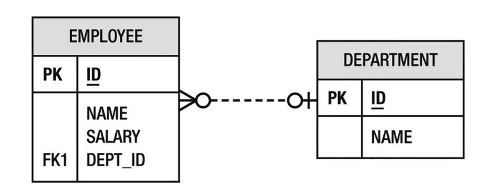

> [!NOTE]
> ID 자동 생성 전략

SequenceGenerator name="Emp_Gen";
GeneratedValue generator = sequenceGenerator.getName(); 

```java

@Id
@SequenceGenerator(name="Emp_Gen", sequenceName="Emp_Seq")
@GeneratedValue(generator="Emp_Gen")
private long getId;
```

# 컬럼매핑



> 조인컬럼 네임을 사용하여 참조하는 엔터티를 저장할 컬럼명 정의
>  

```java

@Entity
public class Employee {
  
@Id 
private long productId;

@ManyToOne
@JoinColumn(name="DEPT_ID")
private Department department;
// ...
}

```
> 원투매니

```java

@Entity
public class Department {
   
    @Id 
    private long productId;
    
    private String name;
   
    @OneToMany(mappedBy="department")
    private Collection<Employee> employees;
    // ...
}


```

```java

@Entity
public class Department {
    @Id
    private long productId;
    
    private String name;
    
    @OneToMany(targetEntity=Employee.class, mappedBy="department")
    private Collection employees;
    // ...
}

```
> 매니투매니


```java


@Entity
public class Employee {
    @Id private long productId;
    private String name;
    @ManyToMany
    private Collection<Project> projects;
    // ...
}
@Entity
public class Project {
    @Id private long productId;
    private String name;
    @ManyToMany(mappedBy="projects")
    private Collection<Employee> employees;
    // ...
}

```
# 테이블 조인
                 
| Employee        |    |    
|-----------------|----|
| PK              | ID |   
|  |  name<br/>salary  |


| EMP_PROJ        |   |
|-----------------|---|
| PK,PK<br/>FK,FK |  EMP_ID<br/>PROJ_ID |
|                 |   |


| Project |      |
|---------|------|
| PK      | ID   |
|         | name |

>>Table Join
> 
>```java
>@Entity
>public class Employee {  
> 
>@Id 
>private long productId;
>private String name; 
> 
>@ManyToMany
>@JoinTable(name="EMP_PROJ",joinColumns=@JoinColumn(name="EMP_ID"),
>inverseJoinColumns=@JoinColumn(name="PROJ_ID"))
>private Collection<Project> projects;   
> 
> // ...           
> 
>}
> 
>```


> 원투원
> 
```java

@Entity
public class Employee {
  
  @Id 
  private long productId;
  
  private String name;
  
  @OneToOne
  @JoinColumn(name="PSPACE_ID")
  private ParkingSpace parkingSpace;
  // ...
}


```
```java


@Entity
public class ParkingSpace {
    @Id 
    private long productId;
    
    private int lot;
    private String location;
    
    @OneToOne(mappedBy="parkingSpace")
    private Employee employee;
    // ...
}

```
